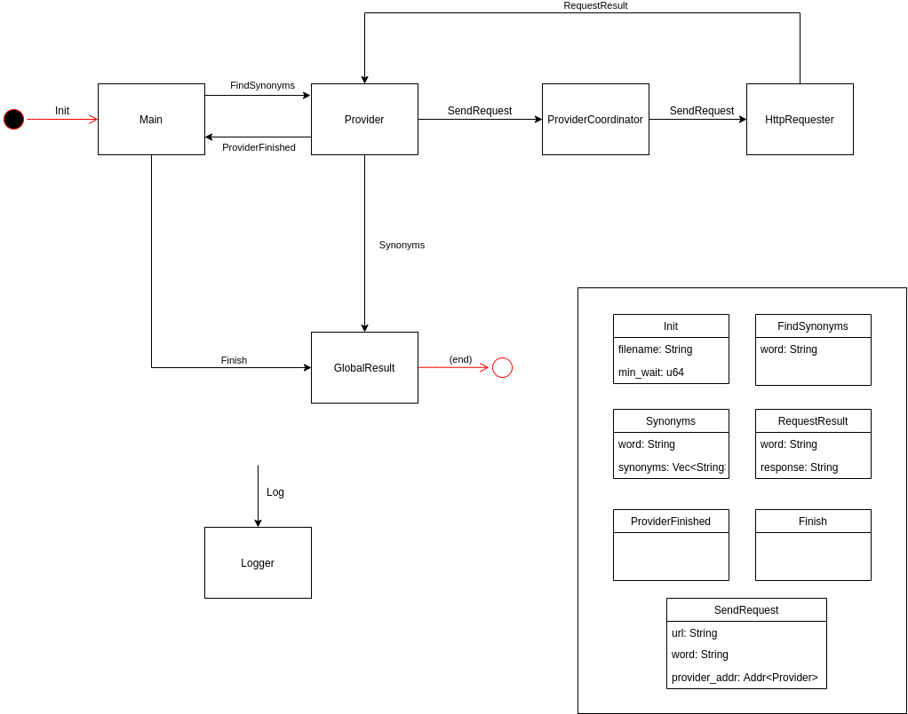

# Trabajo Práctico 2 - Buscador de Sinónimos Rústico

## Integrantes
|Integrante|Padrón|Mail|
|----------|------|----|
|Botalla, Tomás| 96356 | tbotalla@fi.uba.ar |
|Alvarez, Dylan| 98225 | dylanalvarez1995@gmail.com |
|Donato, Juan Pablo| 100839 | judonato@fi.uba.ar |
## Introducción
El objetivo de este informe será presentar y detallar las soluciones implementadas por el grupo 1 para la construcción del trabajo práctico 2, el cuál consistió en implementar un buscador de sinónimos de palabras utilizando distintos proveedores de información en la web, mediante el uso del lenguaje de Rust, sus distintas alternativas para manejar concurrencia y librerias.

## Solución A - "Sin Actores"
Para la solución A (a la que decidimos llamar "sin actores") lo que intentamos hacer fue aplicar la mayor cantidad y variedad de las herramientas de manejo de concurrencia vistas en clase, como *Semaforos, Canales, Condvars y Mutex*. A continuación, el detalle del programa.

- Para lo que son los "proveedores" de sinónimos (Thesaurus, Thesaurus2 y Merriam-Webster), para cada uno de ellos creamos un thread que realiza las siguientes tareas:
  - Lee el archivo de input de palabras
  - Por cada palabra a buscarle los sinónimos, se crea un thread que hace el trabajo de hacer el request HTTP, parsear esa respuesta, obtener los sinónimos y luego enviarlos a través de un *canal* al thread que recolecta los resultados (lo veremos en los siguientes puntos). Cada uno de estos threads lanzados se almacenan en una lista.
- Para la recolección de los resultados finales, lanzamos un thread al que denominamos `result_builder` el cual recibe a través del canal que mencionamos antes los resultados de los distintos proveedores ejecutados, y los almacena en una estructura de tipo hash llevando el conteo de las repeticiones de cada sinónimo. Además, cuando ya no queden threads de tipo "providers" ejecutándose, el `result_builder` recibirá un mensaje indicando que ya no hay más sinónimos, devolviendo el resultado final en el join.
- Para lo que es el manejo de la *cantidad maxima de requests concurrentes* que se pueden realizar a los distintos sitios, utilizamos un **semáforo** inicializado con el parámetro enviado por línea de comandos en donde, previo a hacer el request, los providers hacen el `semaphore.acquire()` necesario, y posteriormente a obtener la respuesta de parte del sitio que corresponda realizan el `semaphore.release()` que corresponde.
- Para lo que es el manejo del *tiempo mínimo entre requests del mismo provider*, nuestra solución propuesta incluye la utilización de una **Condvar** (con su **Mutex**) correspondiente, en donde cada provider, previo a parsear el archivo de sinónimos, lanza un thread que denominaremos `sleeper` cuya función es recibir una alerta de algún provider que quiera buscar un sinónimo (a través de un **canal**), y el `sleeper` efectuará un `sleep` del *tiempo mínimo entre requests* y notificara a los proveedores que están esperando que se ha cumplido este tiempo, utilizando la variable condicional mencionada anteriormente. Por si parte, los providers no avanzaran en el proceso de efectuar el request HTTP al sitio que le corresponda hasta tanto no obtener el mutex de la variable condicional, y que el valor de dicha variable sea el indicado (simplemente, un booleano en `true` en nuestro caso).
- Para lo que se trata del registro de sucesos a través de un archivo de output, lo que implementamos fue un thread denominado `logger` que recibe mensajes a través de un **canal** (cuya referencia 'sender' está compartida por todos los demás threads) y los deposita en el archivo de output.
- Para finalizar, el thread "main" de la aplicación, luego de lanzar todos los threads indicados procede a:
  - Hacer un `join` a todos los providers lanzados hasta que finalicen con su tarea
  - Enviar un mensaje al `result_builder` para indicarle que ya finalizaron todos los providers (mensaje del tipo `NoMoreSynonyms`)
  - Hacer un `join` al `result_builder` para obtener el resultado e imprimirlo.
  - En el proceso, utilizar al `logger` para dejar registros del flujo de la aplicación.
## Solución B - "Con Actores"

En esta sección explicaremos los detalles más importantes de esta solución B, donde como herramienta principal de manejo de concurrencia utilizamos el modelo de **Actores**, provistos por la librería *actix*. A continuación, un gráfico de soporte para entender la arquitectura básica y el modelo de actores implementados en esta sección:



En el esquema, podemos ver a los siguientes Actores:

|Actor|Descripción|
|-----|-----------|
|**Main** |Actor principal en la solución. Da comienzo a la ejecución del proceso|
|**Provider**| Actor que representa a un proveedor (por ejemplo, Merriam-Webster). Son "tipados" según el proveedor que les toca y contienen la lógica de parseo, según el sitio|
|**Provider Coordinator**| Actor que contiene la lógica de coordinación y tiempo mínimo entre requests de proveedores del mismo sitio.|
| **HttpRequester** | Encargado de realizar el request Http al sitio del proveedor con la palabra que se le indique. Devuelve el body del request. Se inicializa con tantos hilos como *cantidad maxima de requests concurrentes* se necesiten |
| **Global Result** | Actor que centraliza el resultado global de la ejecución del programa. Dada una palabra y una lista de sinónimos, los agrupa y lleva el conteo de las repeticiones según resultados. Una vez recibido el mensaje de finalización, es el encargado de detener el runtime de Actix |
| **Logger** | Actor que tiene la tarea de logear sucesos indicados en el archivo de output |

<br>
<br>
<br>
Por otra parte también podemos ver la lista de Mensajes de comunicación entre actores implementados. A continuación, el detalle:

|Mensaje|Descripción|
|-------|-----------|
| *Init* | Mensaje de inicio del programa. Contiene la ruta del archivo a parsear con las palabras a buscar y el tiempo de espera mínimo en milisegundos |
| *FindSynonyms* | Mensaje de petición a un provider para buscar los sinónimos de determinada palabra |
| *SendRequest* | Mensaje de petición de realización de request Http contra un sitio en particular, para buscar los sinónimos de una palabra. Contiene ademas la dirección de la casilla del proveedor que espera recibir el resultado. |
| *RequestResult* | Mensaje enviado por el actor HttpRequester una vez obtenida la respuesta del llamado Http. Contiene el cuerpo de la respuesta Http que contiene los sinónimos de la palabra buscada. El destinatario de este mensaje es el actor Provider |
| *Synonyms* | Luego de realizar la tarea de parseo que le corresponda a cada proveedor, mediante este mensaje se envían la palabra y la lista de sinónimos encontrados al actor GlobalResult |
| *ProviderFinished* | Mensaje que envía un proveedor para indicar que su tarea ha finalizado |
| *Finish* | Mensaje final para indicar que todos los proveedores han finalizado y se espera obtener el resultado final |
| *Log* | Mensaje que contiene la cadena a escribir en el archivo de output del proceso |

<br>
<br>
Luego del detalle de los principales componentes, pasamos a describir las características del flujo principal del programa para realizar la búsqueda de los sinónimos y obtener el resultado final:

- En la función `start_actors` que se llama para comenzar el programa se inicializan los actores **Main**, **GlobalResult**, **Logger** y **HttpRequester**, y se envía el mensaje *Init* al **Main** para comenzar la ejecución.
  - La caracteristica esencial en este paso es la forma en como se inicializan los actores **HttpRequester** y **Logger**, la cual es clave tanto para limitar la cantidad máxima de requests concurrentes permitidos, como para escribir las operaciones a un archivo en un hilo separado. En lugar de inicializarlo utilizando la forma mas convencional (`Actor.start()`), la cual inicia a los actores dentro del Arbitrer principal, con su hilo y event loop correspondientes, para estos dos actores su inicialización se hace con la función `SyncArbitrer::start` provista por la librería de actix. Esta forma permite indicarle que cantidad de threads tiene que levantar para inicializar el actor que le pasamos por parámetro y, en consecuencia ese actor se ejecutará en esos hilos. De esta forma, por ejemplo, si quisiéramos realizar como máximo 3 requests de forma concurrente, entonces pasándole el número indicado a esta función podríamos crear de alguna manera tres instancias del **HttpRequester** que permitirán procesar tres mensajes *SendRequest* como máximo de forma concurrente. Algo similar es lo que se hace con el actor **Logger** donde, se lo inicializa con la función `SyncArbitrer::start` con un hilo dedicado, permitiendo que las operaciones de este actor que son escrituras a disco, no afecten a la ejecución de los demás actores.
- Luego de recibir el mensaje *Init*, el actor **Main** instancia un **Provider** de cada tipo, junto con el **ProviderCoordinator** que le corresponda. De esta forma, cada **Provider** de cada tipo tiene su propio **ProviderCoordinator**.
- Luego de instanciar los proveedores, parsea el archivo de palabras y envía un mensaje *FindSynonyms* a cada proveedor que tenga para indicarle que debe buscar los sinónimos de esa palabra.
- Para comenzar, cada **Provider** necesita del material para parsear. Entonces, envía el mensaje *SendRequest* al **HttpProvider**, utilizando a su **ProviderCoordinator** como "middleware" en la operación.
  - La tarea del coordinador es entonces, hacer de mediador entre el provider y el requester para coordinar los tiempos mínimos entre requests para cada proveedor.
  - La forma de hacerlo es frenando al Coordinator por un tiempo `MIN_TIME_BEWTWEEN_REQUESTS` de recibir nuevos eventos, y simplemente luego reenviar el mensaje al **HttpRequester**.
- Al recibir el mensaje *SendRequest*, el requester efectúa la petición al proveedor indicado, y devuelve la respuesta a la dirección del provider que lo haya solicitado.
- Cuando el provider reciba la respuesta, parsea el HTML del contenido (segun las reglas establecidas para cada proveedor), y envía al **GlobalResult** la lista de sinónimos encontrados. Por último, envía el mensaje *ProviderFinished* al actor **Main** para indicarle que ha finalizado su tarea.
- El actor **Main** lleva el conteo de la cantidad de **Providers** que hayan finalizado su tarea de búsqueda de sinónimos. Cuando todos hayan terminado de buscar los sinónimos de todas las palabras, envía el mensaje final *Finish* al **GlobalResult** para que devuelva como output el resultado final.
  - Al recibir el mensaje *Finish*, el actor **GlobalResult** envía un mensaje final al **Logger** con la función `send()` a diferencia de los demás que se ejecutaban con `try_send()`. Esto hace que se espere por la respuesta del **Logger**, lo cual es necesario ya que si no se esperara, podría ocurrir que el **GlobalResult** finalice la ejecución con `System::current().stop()` antes de que el **Logger** terminara de procesar los mensajes en su casilla.

## Ejecución del programa
El programa recibe 4 parámetros de entrada:
- **option**: con cual de las soluciones hacer la búsqueda. Valores posibles: *actors* / *without_actors*
- **max_concurrent_requests**: cantidad máxima de requests HTTP a procesar en forma concurrente para todos los sitios
- **min_seconds_between_requests**: tiempo mínimo de espera entre dos requests HTTP sucesivos para un sitio dado
- **filename**: nombre del archivo que contiene las palabras a buscar

Por ejemplo para ejecutar la solución con el modelo de actores, con a lo sumo 2 requests en forma paralela, un tiempo mínimo de 1 segundo entre requests para un mismo proveedor, y dado un archivo de entrada words.txt, ejecutar:
``` 
cargo run actors 2 1 words.txt
```

## Conclusiones

Con el desarrollo del presente trabajo práctico, hemos puesto en práctica la mayoría de los conceptos y herramientas vistas durante el curso de la materia hasta el momento, de los cuales podemos destacar:

- La utilización de Rust como lenguaje de programación, junto con sus librerías estándar y otras (como `reqwest` o `actix`) para lograr el manejo de la concurrencia.
- El diseño de programas poniendo central importancia en la concurrencia
- El empleo de herramientas de manejo de concurrencia tradicionales como ser *Semáforos, Condvars, Mutexes y Canales* durante la ejecución de un programa multi-thread para lograr la coordinación entre ellos.
- El empleo de un modelo orientado en *Actores y Mensajes* como opción alternativa de herramienta de manejo de concurrencia.
- Conceptos y técnicas básicas de programación en Rust, como ser estructuración de un programa en Rust, escritura en archivos, efectuar consultas HTTP a través de la web, y hasta testing.
